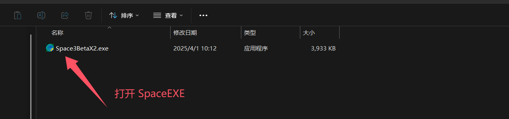
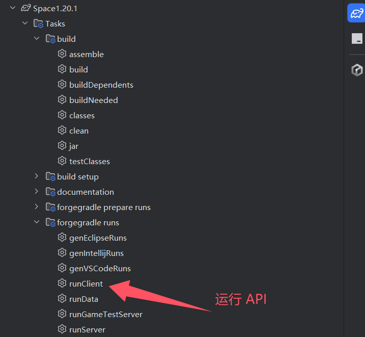

# HelloSpace3 - 1.20.1

### 介绍
我的世界 Space3 开源 Api 模板  
NirvanaGen 架构开发，适配 Space3 外置热注入。 
NirvanaGen 是基于 ForgeMDK 官方 API 的架构，用于搭配 Space3 使用。 
NirvanaGen 高效率，高性能，高速度的开源API，使用 MIT 许可，开放自由，无限可能。 

### 使用说明

#### 打开 Space3
1. 

#### 运行 runClient
2. 

### 开源声明
MIT 许可证是一种高度宽松的开源协议，以简洁的条款赋予使用者极大的自由度，同时保留原作者的基本权利。以下是其核心要点

#### 主要条款
1. 自由使用 
允许个人或商业项目免费使用、复制、修改、合并软件，无任何限制。
2. 分发与再授权 
可自由分发原始或修改后的软件，甚至可转售（需保留原版权声明）。
3. 版权声明要求 
分发时必须包含原许可证文本及版权声明，确保原作者署名权。

### 涅槃科技
1. https://npyyds.top/
2. https://pd.qq.com/s/7s4bjpv06

### 开源来源
https://npyyds.top/ 
https://gitee.com/newNP/hellospace3/ 
https://github.com/NirvanaTec/hellospace3/ 